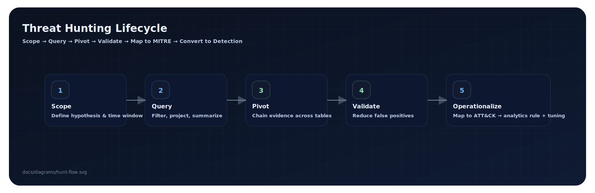
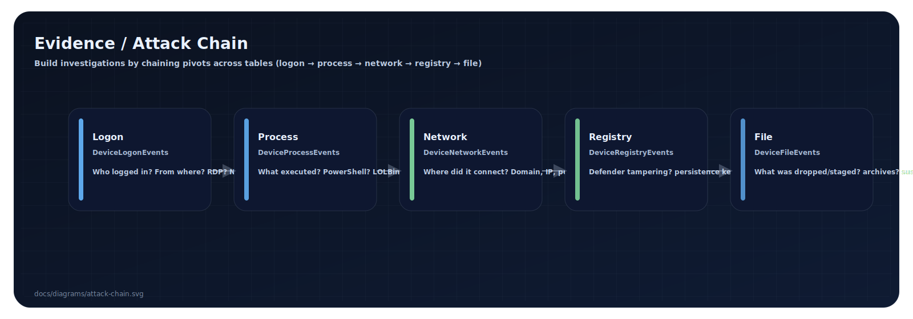
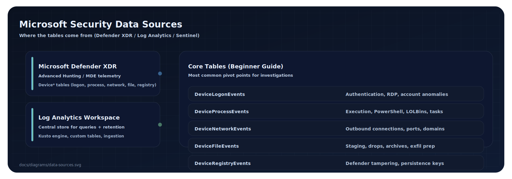

---

## Overview

**KQL Log Analysis & Threat Hunting** is a practical, end-to-end guide for learning **Kusto Query Language (KQL)** in Microsoft security environments (Microsoft Sentinel, Microsoft Defender XDR, and Log Analytics).

This repo is designed to help you:
- Think like an analyst (scope → pivot → validate → document)
- Build repeatable KQL “muscle memory”
- Translate hunts into **detections** (analytics rules) and **coverage**

---

## Demo: What You’ll Be Able To Do

> Hunt suspicious behavior across identity, endpoint, process, network, file, and registry telemetry — and produce a defensible investigation narrative.

### Hunting Lifecycle (Visual)


---

# Core Capabilities

| Category | Capability |
|---|---|
| KQL Fundamentals | Filtering, projection, summarization, time-scoping |
| Threat Hunting | Multi-table pivots and hypothesis-driven investigation |
| Evidence Chaining | Logon → Process → Network → Registry → File correlation |
| MITRE Mapping | Translate behaviors into ATT&CK tactics/techniques |
| Detection Engineering | Convert hunts into rule logic + tuning guidance |
| Reporting | Produce analyst-ready notes, timelines, and findings |

---

# Evidence / Attack Chain Model



**Principle:** Don’t hunt in one table. Build a chain:
- **Logon** (who / where from)
- **Process** (what executed)
- **Network** (where it talked)
- **Registry** (what changed)
- **File** (what staged / dropped)

---

# Data Sources Covered (Microsoft Tables)



### Key Tables You’ll Use
- `DeviceLogonEvents`
- `DeviceProcessEvents`
- `DeviceNetworkEvents`
- `DeviceFileEvents`
- `DeviceRegistryEvents`

---

# Detection Coverage Matrix (Starter)

| MITRE Tactic | What you hunt | Primary tables |
|---|---|---|
| Initial Access | Suspicious remote logons / RDP / anomalous IPs | `DeviceLogonEvents` |
| Execution | PowerShell/LOLBin patterns, encoded commands | `DeviceProcessEvents` |
| Discovery | `whoami`, `arp -a`, `net view`, enumeration | `DeviceProcessEvents` |
| Defense Evasion | Defender exclusions, tampering | `DeviceRegistryEvents` |
| Persistence | Scheduled tasks, startup patterns | `DeviceProcessEvents`, `DeviceRegistryEvents` |
| Command & Control | Suspicious outbound destinations / ports | `DeviceNetworkEvents` |
| Collection/Exfil | ZIP staging, cloud endpoints, bulk transfer signals | `DeviceFileEvents`, `DeviceNetworkEvents` |

---

# Guide

## Table of Contents
- [Why KQL Matters](#why-kql-matters)
- [What Logs Actually Are](#what-logs-actually-are)
- [How Logs Are Stored (Log Analytics Workspace)](#how-logs-are-stored-log-analytics-workspace)
- [Core Security Tables Explained](#core-security-tables-explained)
- [KQL Fundamentals](#kql-fundamentals)
- [Investigation Workflow Framework](#investigation-workflow-framework)
- [Full Threat Hunt Walkthrough (20 Flags)](#full-threat-hunt-walkthrough-20-flags)
- [Reusable Query Cheat Sheet](#reusable-query-cheat-sheet)
- [Using AI to Accelerate Threat Hunting](#using-ai-to-accelerate-threat-hunting)
- [Final Lessons & Career Impact](#final-lessons--career-impact)
- [What You Should Now Be Able To Do](#what-you-should-now-be-able-to-do)
- [Closing](#closing)

---

## 🎯 Why KQL Matters

If you want to work in:

- SOC (Security Operations Center)
- Threat Hunting
- Incident Response
- Cloud Security (Azure)
- Microsoft Defender / Sentinel environments

👉 **KQL is near-essential.**

KQL is used to:

- Investigate alerts
- Perform threat hunts
- Build dashboards
- Create detections
- Tune alerts
- Analyze breaches

It is one of the biggest differentiators between:

- L1 analyst
- L2/L3 analyst
- Security engineer

If you can think in KQL, you can think in:

- SQL
- SPL
- Other SIEM query languages

---

## 🧾 What Logs Actually Are

Logs are:

- 📌 Digital records of activity on systems.

Examples of events that generate logs:

- Logon success/failure
- Process execution (PowerShell, cmd, certutil)
- File creation/deletion
- Network connections
- Registry modifications
- Scheduled task creation
- Firewall activity

Think of logs as:

- 🎥 Security cameras for your IT environment — but in text form.

Without logs:

- You cannot investigate.
- You cannot prove compromise.
- You cannot detect attacks.

---

## 🗄️ How Logs Are Stored (Log Analytics Workspace)

In enterprise environments, logs from:

- Endpoints
- Azure
- Firewalls
- Identity systems

...are forwarded to a central repository.

In Microsoft environments, that’s usually:

- Log Analytics Workspace
- Sometimes Azure Data Explorer

Think of it like:

- 🧮 Millions of gigantic spreadsheets (tables)

At scale, you may have:

- Millions
- Hundreds of millions
- Billions of records

Which is why:

- You cannot manually scroll logs.
- You must query them.

---

## 🗂️ Core Security Tables Explained

These are the most important tables for threat hunting.

### 🔐 DeviceLogonEvents
**Used for:**
- RDP activity
- Logon success/failure
- Remote IP identification

**Common fields:**
- `AccountName`
- `RemoteIP`
- `ActionType`
- `LogonType`

### 🖥️ DeviceProcessEvents
**Used for:**
- Command execution
- PowerShell activity
- LOLBins (`certutil`, `bitsadmin`, `mstsc`, `schtasks`)
- Credential dumping tools

**Common fields:**
- `FileName`
- `ProcessCommandLine`
- `InitiatingProcessCommandLine`

### 📁 DeviceFileEvents
**Used for:**
- File creation
- Folder creation
- ZIP archive staging
- Malware placement

**Common fields:**
- `FileName`
- `FolderPath`
- `ActionType`

### 🌐 DeviceNetworkEvents
**Used for:**
- Command & Control (C2)
- Data exfiltration
- Remote connections
- Port identification

**Common fields:**
- `RemoteIP`
- `RemotePort`
- `RemoteUrl`
- `InitiatingProcessFileName`

### 🧩 DeviceRegistryEvents
**Used for:**
- Defender exclusions
- Persistence changes
- Security configuration tampering

**Common fields:**
- `RegistryKey`
- `RegistryValueName`
- `RegistryValueData`

---

## 🧠 KQL Fundamentals

### 1) Start small (never dump the entire table)
```kql
DeviceLogonEvents
| take 10
```

### 2) Filter with `where`
```kql
DeviceLogonEvents
| where DeviceName == "TARGET-VM"
```

### 3) Control time
**Last 24 hours:**
```kql
| where TimeGenerated > ago(1d)
```

**Specific range:**
```kql
| where TimeGenerated between (datetime(2025-01-01) .. datetime(2025-01-02))
```

### 4) Reduce columns with `project`
```kql
| project TimeGenerated, AccountName, RemoteIP, ActionType
```

### 5) Count and summarize activity
```kql
| summarize count() by RemoteIP
```

Rename count field:
```kql
| summarize LoginAttempts=count() by RemoteIP
```

### 6) Sort results
```kql
| sort by TimeGenerated asc
```

### 7) Show distinct values
```kql
| distinct RegistryValueName
```

### 8) Query pattern to memorize
```kql
TableName
| where TimeGenerated > ago(24h)
| where <filter>
| project <columns>
| summarize <aggregation>
| sort by <field>
```

---

## 🧭 Investigation Workflow Framework

Use this sequence during hunts:

1. **Scope** the device/user/time range.
2. **Identify initial access** indicators.
3. **Pivot across tables** (process, network, file, registry).
4. **Build timeline** of attacker actions.
5. **Map to MITRE ATT&CK** techniques.
6. **Validate findings** with additional evidence.
7. **Document artifacts** (IOCs, accounts, commands, hosts).

---

## 🧪 Full Threat Hunt Walkthrough (20 Flags)

> Scenario: Investigate suspicious activity on `TARGET-VM` and recover key attack artifacts.

### 🔐 Phase 1 — Initial Access

**Flag 1 – Suspicious source IP**
```kql
DeviceLogonEvents
| where DeviceName == "TARGET-VM"
| where ActionType == "LogonSuccess"
| summarize Logins=count() by RemoteIP
| sort by Logins desc
```

**Flag 2 – Compromised account**
```kql
DeviceLogonEvents
| where DeviceName == "TARGET-VM"
| project AccountName
| distinct AccountName
```

### 🔍 Phase 2 — Discovery

**Flag 3 – Network enumeration command**
```kql
DeviceProcessEvents
| where DeviceName == "TARGET-VM"
| where ProcessCommandLine has "arp"
| project TimeGenerated, ProcessCommandLine
```
Example found: `arp -a`

### 🛡️ Phase 3 — Defense Evasion

**Flag 4 – Malware staging directory**
```kql
DeviceFileEvents
| where DeviceName == "TARGET-VM"
| project TimeGenerated, FolderPath, FileName
| sort by TimeGenerated asc
```
Look for suspicious directories like: `C:\ProgramData\WindowsCache\`

**Flag 5 – Defender extension exclusions**
```kql
DeviceRegistryEvents
| where RegistryKey has "Exclusions"
| distinct RegistryValueName
```
Count suspicious exclusions.

**Flag 6 – Defender folder exclusion**
```kql
DeviceRegistryEvents
| where RegistryKey has "Exclusions\\Paths"
| project RegistryValueName
```

**Flag 7 – LOLBin used to download malware**
```kql
DeviceProcessEvents
| where ProcessCommandLine has "certutil"
| project ProcessCommandLine
```

### ♻️ Phase 4 — Persistence

**Flag 8 – Scheduled task name**
```kql
DeviceProcessEvents
| where FileName =~ "schtasks.exe"
| project ProcessCommandLine
```
Look for: `/TN "WindowsUpdateCheck"`

**Flag 9 – Scheduled task target**
- Parse the `/TR` parameter from the command line.

### 🌐 Phase 5 — Command & Control

**Flag 10 – C2 IP**
```kql
DeviceNetworkEvents
| where DeviceName == "TARGET-VM"
| where InitiatingProcessFolderPath has "ProgramData"
| project RemoteIP, RemotePort
```

**Flag 11 – C2 port**
- Use the same query and inspect `RemotePort`.

### 🔓 Phase 6 — Credential Access

**Flag 12 – Credential dumping tool**
```kql
DeviceProcessEvents
| where ProcessCommandLine has "sekurlsa"
| project FileName, ProcessCommandLine
```
Often observed: `mm.exe` (renamed mimikatz).

**Flag 13 – Module used**
- Inspect command lines for: `sekurlsa::logonpasswords`

### 📦 Phase 7 — Collection & Exfiltration

**Flag 14 – ZIP archive**
```kql
DeviceFileEvents
| where FileName endswith ".zip"
| project FileName, FolderPath
```

**Flag 15 – Cloud service used**
```kql
DeviceNetworkEvents
| where RemoteUrl has "discord"
| project RemoteUrl
```

### 🧹 Phase 8 — Anti-Forensics

**Flag 16 – First log cleared**
```kql
DeviceProcessEvents
| where ProcessCommandLine has "wevtutil"
| sort by TimeGenerated asc
```
Look for: `wevtutil cl security`

### 👤 Phase 9 — Backdoor Account

**Flag 17 – Hidden admin user**
```kql
DeviceProcessEvents
| where ProcessCommandLine has "net user"
| project ProcessCommandLine
```
Example: `net user support P@ssw0rd /add`

### 📜 Phase 10 — Attack Script

**Flag 18 – PowerShell script**
```kql
DeviceProcessEvents
| where ProcessCommandLine endswith ".ps1"
| project ProcessCommandLine
```

### 🔁 Phase 11 — Lateral Movement

**Flag 19 – Target IP**
```kql
DeviceProcessEvents
| where ProcessCommandLine has "mstsc"
| project ProcessCommandLine
```

**Flag 20 – Remote access tool used**
- Likely: `mstsc.exe`

---

## 🧰 Reusable Query Cheat Sheet

### Logons
```kql
DeviceLogonEvents
| where TimeGenerated > ago(7d)
| project TimeGenerated, AccountName, ActionType, RemoteIP
```

### Processes
```kql
DeviceProcessEvents
| where TimeGenerated > ago(7d)
| project TimeGenerated, FileName, ProcessCommandLine
```

### Files
```kql
DeviceFileEvents
| where TimeGenerated > ago(7d)
| project FileName, FolderPath
```

### Network
```kql
DeviceNetworkEvents
| where TimeGenerated > ago(7d)
| project RemoteIP, RemotePort, RemoteUrl
```

---

## 🤖 Using AI to Accelerate Threat Hunting

You can:

- Export query results
- Upload CSV to ChatGPT/Claude
- Ask AI to:
  - Identify suspicious command usage
  - Find credential dumping indicators
  - Identify LOLBins
  - Explain process chains

⚠️ Always verify findings back in KQL.

AI is an assistant — not a replacement.

---

## 🚀 Final Lessons & Career Impact

By completing a hunt like this, you demonstrate:

- Real log analysis capability
- Multi-table pivoting skill
- Attack chain understanding
- MITRE ATT&CK alignment
- Practical SOC-level investigation experience

This is resume-ready experience.

---

## 🎓 What You Should Now Be Able To Do

- Filter massive log datasets
- Identify suspicious IPs
- Detect credential dumping
- Identify persistence mechanisms
- Track C2 activity
- Detect exfiltration channels
- Recognize anti-forensics
- Pivot between tables
- Use `summarize` intelligently
- Explain an attack chain end-to-end

---

## 🏁 Closing

KQL is not about memorizing syntax.

It’s about learning to think:

> “What evidence would this action leave behind — and in which table?”

Master that, and you can hunt anything. 🔥

---
---
---
---

# Screenshot Panels (Executive Polish)

> Drop 2–4 screenshots here once you capture them from Sentinel / Defender Advanced Hunting.

## Example: Hunt Results (Logon Pivot)


## Example: Process → Network Correlation


## Example: Registry Tampering / Exclusions


---

# Built By

**Brian Hannigan**  
Cybersecurity Engineer • Software Architect  
Focus: Threat Hunting, Detection Engineering, and defensible investigation workflows
